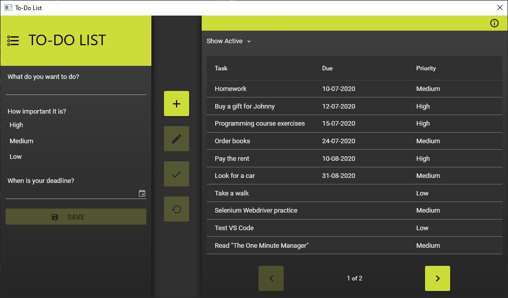

# ToDoListDesktopApp

### Overview
ToDoListDesktopApp is a simple WPF application to track your daily tasks.

### Features
* Display active tasks
* Display completed tasks
* Add new task
* Set task priority (required)
* Set task due date (optional)
* Edit task
* Mark task as completed
* Restore task as active

### To do
* ~~Display completed tasks~~
* ~~Restore task as active~~
* ~~Edit task~~
* ~~GUI redesign using Material Design In XAML Toolkit~~
* ~~Button tooltips~~

### Technologies
* Windows Presentation Foundation (WPF)
* C# .NET Framework 4.7.2
* Entity Framework 6.0.0
* MS SQL
