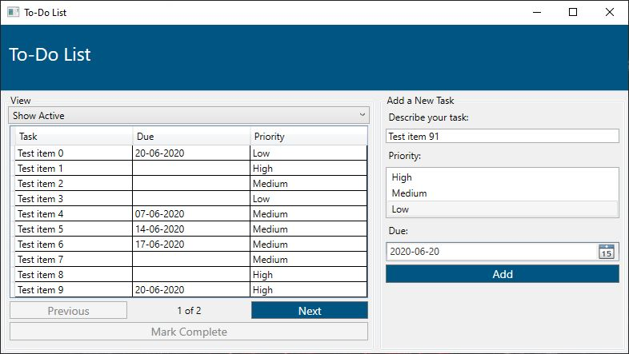

# ToDoListDesktopApp

### Overview
ToDoListDesktopApp is a simple WPF application to track your daily tasks.

### Features
* Display active tasks
* Display completed tasks
* Add new task
* Set task priority (required)
* Set task due date (optional)
* Mark task as completed

### To do
* ~~Display completed tasks~~
* Restore task as incomplete
* Edit task

### Technologies
* Windows Presentation Foundation (WPF)
* C# .NET Framework 4.7.2
* Entity Framework 6.0.0
* MS SQL
